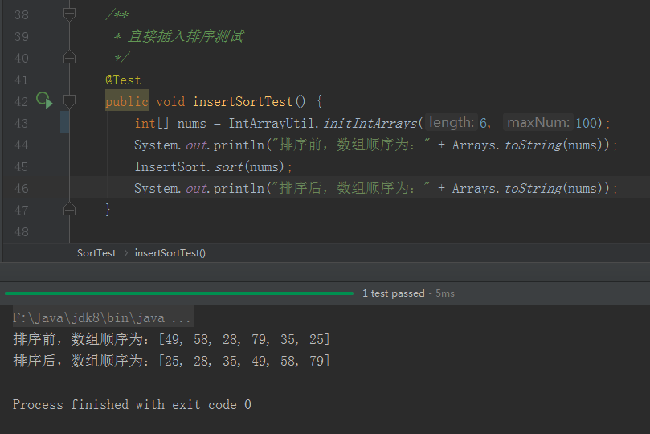
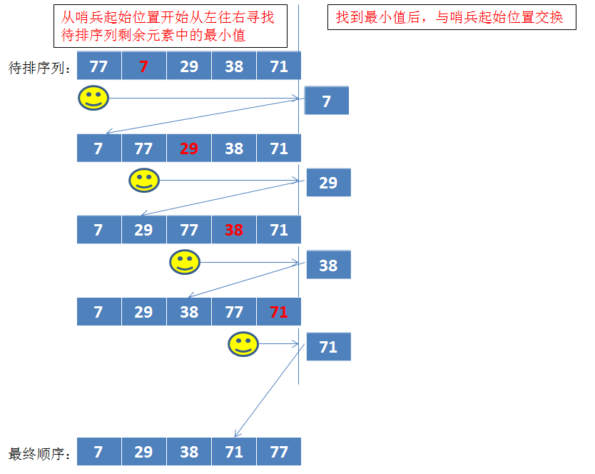

# 八大排序算法

<font color="red">程序 = 数据结构 + 算法</font>。<br/>
设计优良程序的两个要点：选用正确的存储结构、采用合理的解决方案。<br/>
算法就是“解决方案”。而排序，是一种非常常见的业务场景，如：“前100名下单的打八折”、“成绩前三的获一等奖”、“绩效最差的扣工资”等等。但排序的实现有很多不同的解决方案，不同的解决方案需要的运算时间和存储空间不同。<br/>
这里说的八大排序算法，都是内部排序（不需要额外的空间存储数据，所有运算时存储的数据都是放在内存中）。他们分别是：<font color="red">冒泡排序、堆排序、直接插入排序、归并排序、快速排序、基数排序、简单选择排序、希尔排序。</font><br/>
接下来，我们来学习并归纳这八种排序的思想以及Java实现。<br/>
具体的Java实现以及测试代码详见于[我的Github](https://github.com/zhenye163/sort)。

由于这些排序里面有一些公用的方法，预先新建工具类如下：

```JAVA
/**
 * 整数数组相关的工具类
 * @author zhenye 2019/1/24
 */
public class IntArrayUtil {

  /**
    * 初始化一个正整数数组
    * @param length 数组长度
    * @param maxNum 数组中元素的最大值
    * @return 正整数数组
    */
  public static int[] initIntArrays (int length, int maxNum) {
    if (length <= 0 || maxNum <= 0) {
      throw new RuntimeException("参数非法");
    }
    int[] nums = new int[length];
    Random random = new Random();
    for(int i = 0; i < length; i++) {
      nums[i] = random.nextInt(maxNum);
    }
    return nums;
  }

  /** 交换数组中下标i与下标j的值
    * @param intArrays 目标数组
    * @param i 数组下标i
    * @param j 数组下标j
    */
  public static void exchangeValue(int[] intArrays, int i, int j) {
    // 如果i==j，通过这种方法交换，会将当前位置的值重置为0
    if(i == j) {
      return;
    }
    intArrays[i] = intArrays[i] ^ intArrays[j];
    intArrays[j] = intArrays[i] ^ intArrays[j];
    intArrays[i] = intArrays[i] ^ intArrays[j];
  }
}
```

## 冒泡排序

基本思想：从左往右比较相邻的两个元素，如果左边元素比右边元素大，交换左右元素。即每轮比较完后，最大值都能到最右边。当所有的轮次比较完后，就是从小到大的顺序。

图解冒泡排序如下图：


冒泡排序的java实现如下：

```JAVA
/**
 * 冒泡排序
 * @author zhenye 2019/1/24
 */
public class BubbleSort {

  public static void sort(int[] nums) {
    // 比较的轮次数
    for(int i = 0;i < nums.length;i++) {
      // 当前轮次需要比较的次数
      for(int j = 0; j < nums.length - i - 1;j++) {
        if(nums[j] > nums[j+1]) {
          IntArrayUtil.exchangeValue(nums, j, j+1);
        }
      }
    }
  }
}
```

冒泡排序的执行结果如下图所示：


## 堆排序

基本思想：堆是一颗顺序存储的完全二叉树。每个节点的值都不大于其子节点的值，这样的称之为“小根堆”，反之则称之为“大根堆”。因此“大根堆”的堆顶元素就是这个堆的最大值。利用将无序序列初始化为“大根堆”，取出其堆顶元素作为最大值，然后将剩余的元素看做无序序列，并再次变为“大根堆”并取出其堆顶元素。重复迭代直到无序序列只有一个元素即排序完毕。

图解堆排序如下图：

1. 如果将一个无序序列，初始化为一个“大根堆”，如下图：


2. 将堆顶元素与最后一个元素交换，将剩余的n-1个元素的无序序列再次初始化为
“大根堆”，并重复。


堆排序的java实现如下：

```JAVA
/**
 * 堆排序
 * @author zhenye 2019/1/24
 */
public class HeapSort {

  public static void sort(int[] nums) {
    // 预先初始化为大根堆
    initBigHeap(nums);
    for(int i = nums.length; i >= 1; i--) {
      // 堆顶元素为最大值，交换到其应该在的位置
      IntArrayUtil.exchangeValue(nums, 0, i - 1);
      // 重新调整，保证数组的前i-1个元素符合大根堆
      adjustBigHeap(nums, 0, i - 1);
    }
  }

  /**
    * 将数组初始化为大根堆
    * @param nums 待排数组
    */
  private static void initBigHeap(int[] nums) {
    // 从最后一个有子节点的节点往前遍历，遍历过程中保证当前节点的左右子节点的值均不大于该节点的值
    // 则遍历到根节点（堆顶元素）时也保证其左右子节点的值均不大于该节点的值，则初始化成功。
    // 即从第i个元素的父节点(第i个元素的下标为i - 1,其父节点的下标为i/2 - 1)开始往前遍历：
    for(int i = nums.length / 2 - 1;i >= 0; i--) {
      adjustBigHeap(nums,i,nums.length);
    }
  }

  /**
    * 保证数组nums的前count个元素中，下标为parent的节点及其子孙节点符合大根堆要求
    * @param nums 待排数组
    * @param parentIndex 目标节点
    * @param count 待排元素个数（nums数组的前count个元素）
    */
  private static void adjustBigHeap(int[] nums, int parentIndex, int count) {
    int leftChildIndex = 2 * parentIndex + 1;
    int rightChildIndex = 2 * parentIndex + 2;
    while(leftChildIndex < count) {
      int toBeComparedIndex;
      // 如果j节点有右子节点，且右子节点比左子节点的值大，则j节点跟右子节点比较，否则跟左子节点比较
      if (rightChildIndex < count && nums[rightChildIndex] > nums[leftChildIndex]) {
        toBeComparedIndex = rightChildIndex;
      } else {
        toBeComparedIndex = leftChildIndex;
      }
      if (nums[toBeComparedIndex] > nums[parentIndex]) {
        IntArrayUtil.exchangeValue(nums, parentIndex, toBeComparedIndex);
        // 交换后，然后还要保证交换后的节点也符合大根堆要求
        adjustBigHeap(nums, toBeComparedIndex, count);
      } else {
        // 当父节点是最大时，停止递归
        break;
      }
    }
  }
}
```

堆排序的执行结果如下图所示：


## 直接插入排序

基本思想：将n个待排序的元素分成一个有序表和一个无序表。开始时有序表只包含第一个元素，无序表包含后面的n-1个元素。排序过程中每次从无序表中取出第一个元素，并直接插入有序表中的合适位置。重复n-1次即排序完毕。

图解直接插入排序如下图：


直接插入排序的java实现如下：

```JAVA
/**
 * 直接插入排序
 * @author zhenye 2019/1/24
 */
public class InsertSort {

  public static void sort(int[] nums) {
    // i为无序表中的元素下标，temp是待插入元素。
    int i,temp;
    for(i = 1;i < nums.length;i++) {
      temp = nums[i];
      // k记录的是待插入元素应该在数组中位置的下标
      int k;
      // 比待插入元素大的元素右移，否则就是找到待插入元素的正确位置k
      for(k = i;k > 0 && nums[k - 1] > temp;k--) {
        nums[k] = nums[k - 1];
      }
      nums[k] = temp;
    }
  }
}
```

直接插入排序的执行结果如下图所示：



## 归并排序

基本思想：采用分治策略将待排序列分成若干个子序列，先将每个子序列进行排序后，再把子序列进行合并即得到排好序的序列。

图解归并排序如下图：


具体归并操作的实现细节图解如下图：


归并排序的java实现：

```JAVA
/**
 * 归并排序
 * @author zhenye 2019/1/24
 */
public class MergeSort {

  /**
    * 提供给开发者使用的归并排序
    * @param nums 待排序数组
    */
  public static void sort(int[] nums) {
    mergeSort(nums, 0, nums.length - 1, new int[nums.length]);
  }

  /**
    * 归并算法的具体实现
    * @param nums 待排序列
    * @param start 数组起始下标
    * @param end 数组截止下标
    * @param temp 临时数组
    */
  private static void mergeSort(int[] nums, int start, int end, int[] temp) {
    // 当[start ... end]数组可以拆分(不只一个元素)时，需要再次拆分
    if(start < end) {
      // 拆分成[start ... mid],[mid + 1 ... end]两个更小的数组）
      int mid = (start + end) / 2;
      mergeSort(nums, start, mid, temp);
      mergeSort(nums, mid + 1, end, temp);
      // 将两个小的有序数组，合并为一个大的有序数组
      merge(nums, start, mid, end, temp);
    }
  }

  /**
    * 将两个小的有序数组，合并为一个大的有序数组
    */
  private static void merge(int[] nums, int start, int mid, int end, int[] temp) {
    // 定义两个旗帜i,j(旗帜i在数组[start ... mid]移动，旗帜j在数组[mid + 1 ... end]移动)
    int i = start;
    int j = mid + 1;
    int k = 0;
    while (i <= mid && j <= end) {
      if(nums[i] > nums[j]) {
        temp[k++] = nums[j++];
      } else {
        temp[k++] = nums[i++];
      }
    }
    while (i <= mid) {
      temp[k++] = nums[i++];
    }
    while (j <= end) {
      temp[k++] = nums[j++];
    }
    // 将临时数组copy到原数组的相应位置
    for(k = 0;start <= end; start++, k++) {
      nums[start] = temp[k];
    }
  }
}
```

归并排序的执行结果如下图所示：


## 快速排序

基本思想：首先在待排序列中随机选取一个基准数（代码实现时默认选取的是第一个元素），然后把待排序列中比这个基准数小的都放在其左边，把待排序列中比这个基准数大的都放在其右边（即找出并将该基准数放到待排序列的正确位置）。然后把该基准数的左右两边看做两个待排序列重复上述操作，直至所有的基准数都找到并放到了正确的位置，则排序完毕。

图解快排排序如下图：


快速排序的java实现如下：

```JAVA
/**
 * 快速排序
 * @author zhenye 2019/1/24
 */
public class QuickSort {

  /**
    * 提供给开发者使用的快速排序
    * @param nums 待排序数组
    */
  public static void sort(int[] nums) {
    quickSort(nums, 0 , nums.length - 1);
  }

  /**
    * 对下标从start到end的正整数数组intArrays进行快速排序
    * @param intArrays 将要排序的数组intArrays
    * @param start 数组起始下标位置
    * @param end 数组截止下标位置
    */
  private static void quickSort(int[] intArrays, int start, int end) {
    if(start > end) {
      return;
    }
    // 将数组起始下标位置的元素，作为基准数
    int base = intArrays[start];
    // 将i看作从左往右搜索的哨兵，j看作从右往左搜索的哨兵
    int left = start;
    int right = end;
    while(left != right) {
      // ！！！因为选取的基准数是左哨兵的起始位置，这里一定要右边的哨兵先走。
      /*
        这里循环结束的条件有一个是左右哨兵相遇。
        如果左哨兵先行，出现由于左哨兵找到了右哨兵（相遇）导致循环结束的情况时，
        左右哨兵的当前元素是基于右哨兵上次循环结束的位置。
        即此时左右哨兵相遇位置的当前元素是比基准数大的！！！将该元素与基准数交换是不对的。
        */
      // 找到右边比基准数小的元素下标（或哨兵相遇）
      while(left < right && intArrays[right] >= base) {
        right--;
      }
      // 找到左边比基准数大的元素下标（或哨兵相遇）
      while (left < right && intArrays[left] <= base) {
        left++;
      }
      if (left < right) {
        // 交换，保证哨兵i左边的元素都比基准数小，哨兵j右边的元素都比基准数大
        IntArrayUtil.exchangeValue(intArrays, left, right);
      }
    }
    // 交换，保证基准数在正确的位置
    IntArrayUtil.exchangeValue(intArrays, start, right);
    // 下一次，迭代（两个子序列分别进行快速排序）
    quickSort(intArrays, start, right - 1);
    quickSort(intArrays, right + 1, end);
  }
}
```

快速排序实现需要注意的地方：<font color="red">当选择的基准数是左哨兵的起始位置时，寻找基准数的最终位置应该是右哨兵先移动。</font>

快速排序的执行结果如下图所示：


## 基数排序

基本思想：又称“桶排序”。依次从低位到高位分解待排序列的元素并排序，当按最高位分解并排序了待排序列后即排序完毕。

图解基数排序如下图：


基数排序的java实现：

```JAVA
/**
 * 基数排序
 * @author zhenye 2019/1/24
 */
public class RadixSort {

  /**
    * 提供给开发人员使用的基数排序
    * @param nums 待排序列
    */
  public static void sort(int[] nums) {
    int maxBit = getMaxBit(nums);
    // temp临时二维数组，列是余数（0-9），行是0或者待排序列中元素的值
    int[][] temp = new int[10][nums.length];
    // order对应下标，即待排序列元素对应余数的个数
    int[] order = new int[10];
    int n = 1;
    int m = 1;
    int k = 0;
    while(m <= maxBit) {
      for (int num : nums) {
        int reminder = (num / n) % 10;
        // 将余数为reminder的元素归到二维数组temp的第reminder列，并记录此时第reminder列元素的个数order[reminder]
        temp[reminder][order[reminder]] = num;
        order[reminder]++;
      }
      // 重排待排序列
      for(int i = 0; i < order.length;i++) {
        if (order[i] != 0) {
          for(int j = 0;j < order[i];j++) {
            nums[k] = temp[i][j];
            k++;
          }
        }
        order[i] = 0;
      }
      // 重置相关变量
      n *= 10;
      k = 0;
      m++;
    }
  }

  /**
    * 找到数组中最大值的位数（如：{32,43,101,2}的最大值是101，位数是3）
    * @param nums 给定数组
    * @return 数组中最大值位数
    */
  private static int getMaxBit(int[] nums) {
    int max = nums[0];
    for(int i = 1;i < nums.length;i++) {
      if(nums[i] > max){
        max = nums[i];
      }
    }
    int maxBit;
    for(maxBit = 1; max >= 10; maxBit++){
      max = max / 10;
    }
    return maxBit;
  }
}
```

<font color="red">基数排序有其局限性，它要求排序的过滤条件能够分解。</font>

基数排序的执行结果如下图所示：


## 简单选择排序

基本思想：从待排序列中找出值最小的元素，如果最小元素不是第一个元素，则将其余第一个元素互换。然后从余下n-1个元素找出最小元素，重复上述操作直至排序结束。

图解简单选择排序如下图：



简单选择排序的Java实现如下：

```JAVA
/**
 * 简单选择排序
 * @author zhenye 2019/1/24
 */
public class SelectSort {
  /**
    * 提供给开发者使用的简单选择排序
    * @param nums 待排序列
    */
  public static void sort(int[] nums) {
    int i,j;
    for(i = 0; i < nums.length; i++) {
      int minValueIndex = i;
      for (j = i;j < nums.length; j++) {
        if (nums[minValueIndex] > nums[j]) {
          minValueIndex = j;
        }
      }
      IntArrayUtil.exchangeValue(nums, i, minValueIndex);
    }
  }
}
```

简单选择排序的执行结果如下图所示：


## 希尔排序

基本思想：先将整个待排序列（按相隔某个“增量”的下标）分割成若干个子序列，并对这些子序列进行直接插入排序。然后依次缩减这个“增量”，分割成子序列并再次进行直接插入排序。重复上述过程到“增量”为1，即对整个待排序列进行了一次直接插入排序。


希尔排序的Java实现如下：

```JAVA
/**
 * 希尔排序
 * @author zhenye 2019/1/24
 */
public class ShellSort {
  /**
    * 提供给开发者使用的希尔排序
    * @param nums 待排序列
    */
  public static void sort(int[] nums) {
    // i为无序表中的元素下标，j为有序表中的元素下标，temp是待插入元素，increment为增量。
    int i, j, temp, increment;
    for(increment = nums.length / 2;increment >= 1; increment = increment / 2){
      for(i = increment; i < nums.length; i++) {
        temp = nums[i];
        j = i - increment;
        for(;j >= 0 && temp < nums[j];j -= increment) {
          nums[j + increment] = nums[j];
        }
        nums[j + increment] = temp;
      }
    }
  }
}
```

希尔排序的执行结果如下图所示：


## 八种排序算法的性能测试

八种排序算法的性能测试代码如下：

```JAVA
/**
  * 排序测试类
  */
public class SortTest {
  /**
    * 各排序算法的性能测试
    */
  @Test
  public void speedTest() {
    int[] initIntArrays = IntArrayUtil.initIntArrays(100000,10000);
    System.out.println("排序前，数组顺序为：" + Arrays.toString(initIntArrays));
    int[] toBubbleSort = initIntArrays.clone();
    Long toBubbleSortStart = System.currentTimeMillis();
    BubbleSort.sort(toBubbleSort);
    Long toBubbleSortEnd = System.currentTimeMillis();
    System.out.println("冒泡排序耗时：" + (toBubbleSortEnd - toBubbleSortStart) + "毫秒。");
    System.out.println("----------------------------------------------------");
    int[] toHeapSort = initIntArrays.clone();
    Long toHeapSortStart = System.currentTimeMillis();
    HeapSort.sort(toHeapSort);
    Long toHeapSortEnd = System.currentTimeMillis();
    System.out.println("堆排序耗时：" + (toHeapSortEnd - toHeapSortStart) + "毫秒。");
    System.out.println("----------------------------------------------------");
    int[] toInsertSort = initIntArrays.clone();
    Long toInsertSortStart = System.currentTimeMillis();
    InsertSort.sort(toInsertSort);
    Long toInsertSortEnd = System.currentTimeMillis();
    System.out.println("直接插入排序耗时：" + (toInsertSortEnd - toInsertSortStart) + "毫秒。");
    System.out.println("----------------------------------------------------");
    int[] toMergeSort = initIntArrays.clone();
    Long toMergeSortStart = System.currentTimeMillis();
    MergeSort.sort(toMergeSort);
    Long toMergeSortEnd = System.currentTimeMillis();
    System.out.println("归并排序耗时：" + (toMergeSortEnd - toMergeSortStart) + "毫秒。");
    System.out.println("----------------------------------------------------");
    int[] toQuickSort = initIntArrays.clone();
    Long toQuickSortStart = System.currentTimeMillis();
    QuickSort.sort(toQuickSort);
    Long toQuickSortEnd = System.currentTimeMillis();
    System.out.println("快速排序耗时：" + (toQuickSortEnd - toQuickSortStart) + "毫秒。");
    System.out.println("----------------------------------------------------");
    int[] toRadixSort = initIntArrays.clone();
    Long toRadixSortStart = System.currentTimeMillis();
    RadixSort.sort(toRadixSort);
    Long toRadixSortEnd = System.currentTimeMillis();
    System.out.println("基数排序耗时：" + (toRadixSortEnd - toRadixSortStart) + "毫秒。");
    System.out.println("----------------------------------------------------");
    int[] toSelectSort = initIntArrays.clone();
    Long toSelectSortStart = System.currentTimeMillis();
    SelectSort.sort(toSelectSort);
    Long toSelectSortEnd = System.currentTimeMillis();
    System.out.println("简单选择排序耗时：" + (toSelectSortEnd - toSelectSortStart) + "毫秒。");
    System.out.println("----------------------------------------------------");
    int[] toShellSort = initIntArrays.clone();
    Long toShellSortStart = System.currentTimeMillis();
    ShellSort.sort(toShellSort);
    Long toShellSortEnd = System.currentTimeMillis();
    System.out.println("希尔排序耗时：" + (toShellSortEnd - toShellSortStart) + "毫秒。");
  }
}
```

我在本地电脑测试的效果图如下：


各排序算法的复杂度如下：


<font color="red">汇总说明：</font>
- 当业务场景简单，数据量较小时，由于计算机运算能力强，各排序算法之间性能差别不大，推荐直接采用稳定易实现的<font color="red">冒泡排序或插入排序</font>。
- 当业务场景复杂，数据量较大时，考虑到要注重性能的优化，推荐使用<font color="red">快速排序、堆排序或归并排序</font>。